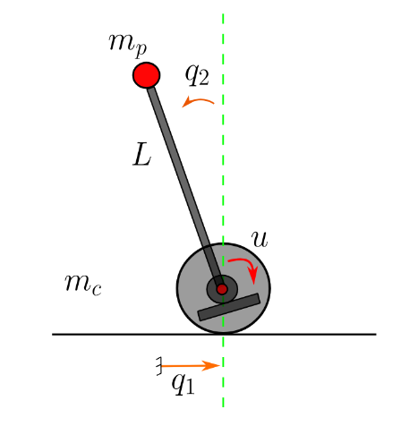
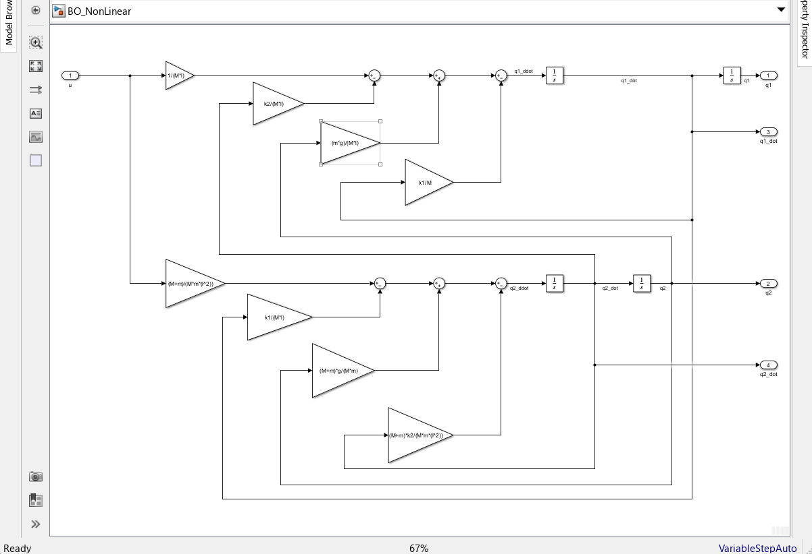
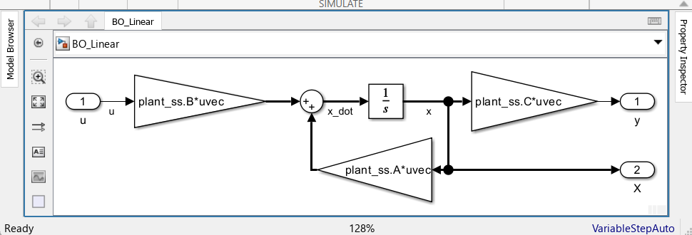
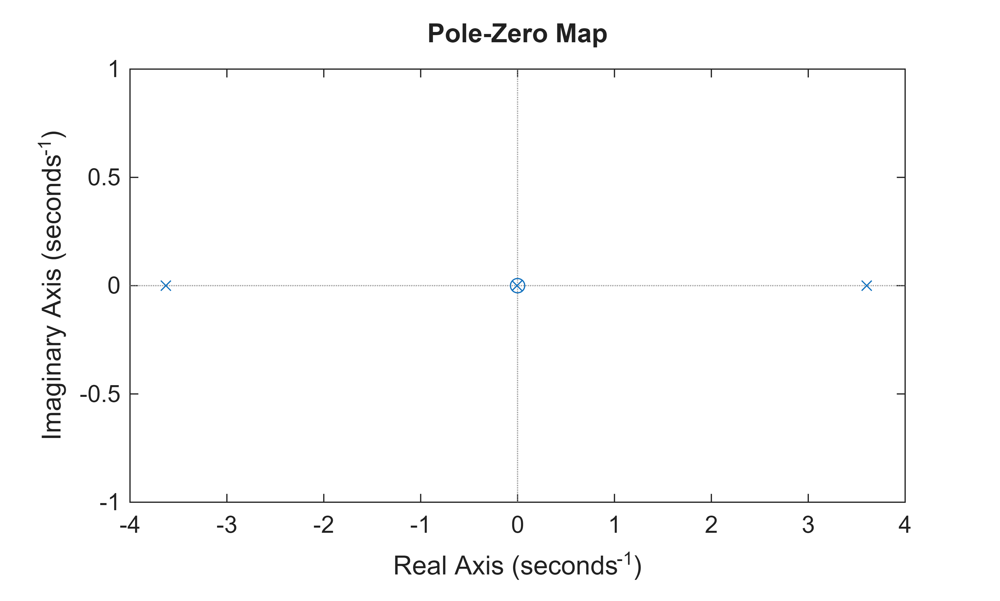
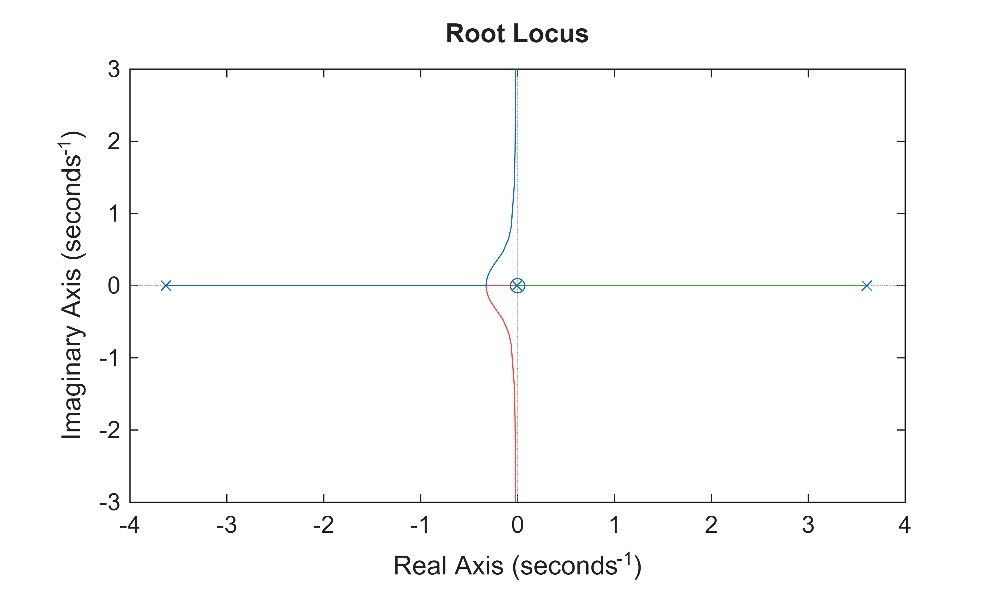
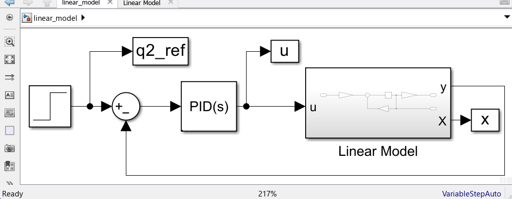
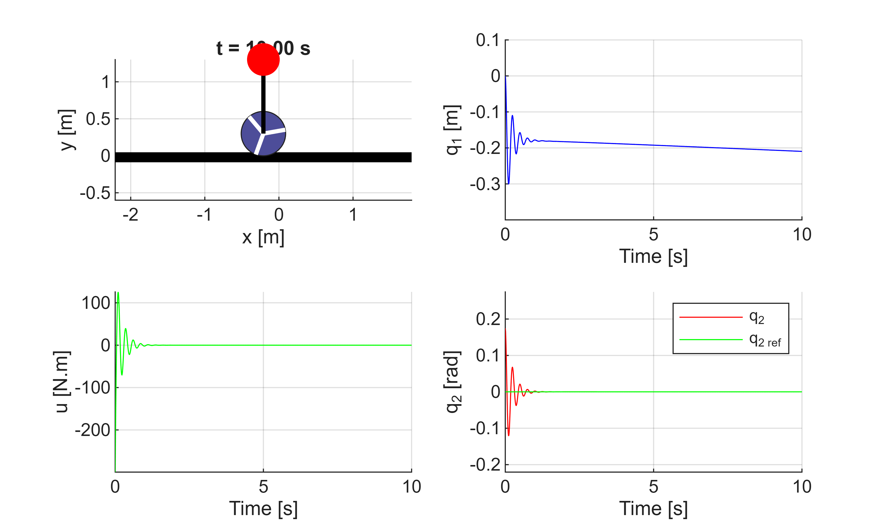
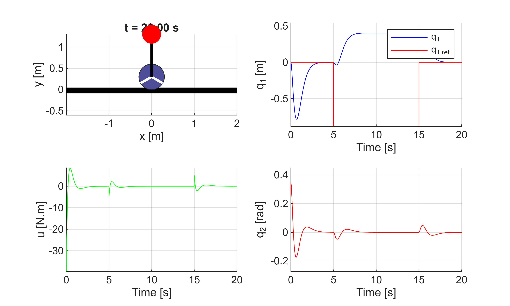
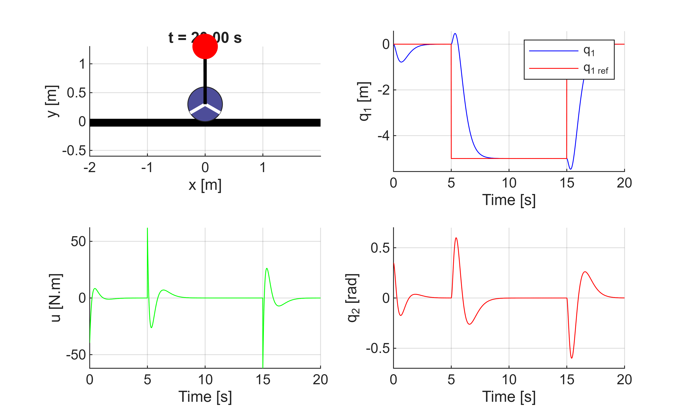

# Pandulum\-Cart System

A mass mp (that will be refered to as m) is attached to a car of mass mc (M) through a massless jonction with a length L (l). The car displacement is induced by a force u.  





The goal of the system is to stabilize the mass mp vertically, keeping the swing angle q2 = 0 by controling the displacement q1 of the car. 


This exercice will cover the following points:

1.  Modeling the system using Lagrangian formalism
2. Linearizing the model arround a fonctionning point of q2=0, to obtain a linear state space model
3. Build a Simulink model of the system (linear and non linear model).
4. Design a state feedback controller to stabilize the system
5. Design a optimal controller
6. Design a mpc controller
## 1. Model of the system

The system has 2 degrees of freedom q1 and q2. 


Considering the (x,y) frame the position of the masses are given as 

 $$ \left\lbrace \begin{array}{ll} \vec{\mathrm{OM}\;}  & =q_1 \vec{\;x} \newline \vec{\;\mathrm{Om}}  & =\left(q_1 -l\;\sin \left(q_2 \right)\right)\;\vec{x} +l\;\cos \left(q_2 \right)\;\vec{\;y}  \end{array}\right. $$ 


The velocities are:

 $$ \left\lbrace \begin{array}{ll} \frac{d\vec{\;\textrm{OM}} }{\textrm{dt}} & =\dot{\;q_1 } \;\vec{\;x} \newline \frac{d\;\vec{\;\textrm{Om}} }{\textrm{dt}} & =\left(\dot{\;q_1 } +l\dot{\;q_2 } \;\cos \left(q_2 \right)\right)\vec{\;x} -l{\dot{\;q} }_2 \sin \left(q_2 \right)\;\vec{\;y}  \end{array}\right. $$ 


The cinetic energy of the system is given as 

 $$ \begin{array}{l} T=\frac{1}{2}M\times v_M^2 +\frac{\;1}{2}m\times v_{m\;}^2 =\frac{\;1}{2}M{\dot{\;q_1 } }^2 +\frac{1}{2}{m\left(\left(\dot{\;q_1 } +l\dot{\;q_2 } \;\cos \left(q_2 \right)\right)\vec{\;x} -l{\dot{\;q} }_2 \sin \left(q_2 \right)\;\vec{\;y} \right)}^2 \newline T=\frac{1}{2}\left(M+m\right){\dot{\;q_1 } }^2 +\frac{1}{2}m\left({l^2 \dot{\;q_2 } }^2 -2l\dot{\;q_1 } \dot{\;q_2 } \cos \left(q_2 \right)\right) \end{array} $$ 

The potential energy of the system is produce only by the mass m as the mass M is already grounded. So we have

 $$ V=\textrm{mgLcos}\left(q_2 \right)\; $$ 


From the about energies equation, we obtain the Lagrangian

 $$ L=T-V=\frac{1}{2}\left(M+m\right){\dot{\;q_1 } }^2 +\frac{1}{2}m\left({l^2 \dot{\;q_2 } }^2 -2l\dot{\;q_1 } \dot{\;q_2 } \cos \left(q_2 \right)\right)-\textrm{mgLcos}\left(q_2 \right)\;\; $$ 

As the system is not only conservative. It also have dissipative force (friction of the contact between wheel and ground), generalized Lagrange equations apply as follows: 

 $$ \frac{d}{\textrm{dt}}\left(\frac{\partial \;L}{\partial \;\dot{\;q_i } }\right)-\frac{\partial \;L}{\partial \;q_i }=Q_i $$ 

Rayleigh dissipative function will be used to introduce the friction force proportionnal to velocity. 

 $$ R\left(\dot{\;q} \right)=\frac{1}{2}\sum_i^N k_i {\;\dot{\;q_i } }^2 =\frac{1}{2}\;\left(k_1 {\dot{\;q_1 } }^2 +k_2 \;{\dot{\;q_2 } }^2 \right) $$ 

the dissipative force is given as $F_i =-\frac{\partial R}{\partial \dot{\;q_i } }\;\;\;;F_1 =-\frac{\partial R}{\partial \dot{\;q_1 } }=-\frac{1}{2}*\left({2*k}_1 \;\dot{\;q_1 } \right)=-k_1 \;\dot{q_1 }$ 


Thus $Q_i \;=F_i +<\textrm{other}\;\textrm{external}\;\textrm{forces}\;\textrm{applied}\;\textrm{to}\;\textrm{particle}\;i>$ 

-  Lagrange equation w.r.t. $q_1$  

 $$ \frac{d}{\textrm{dt}}\left(\frac{\partial \;L}{\partial \;\dot{\;q_1 } }\right)-\frac{\partial \;L}{\partial \;q_1 }=-k_1 \;\dot{\;q_1 } +u $$ 

 $\frac{\partial \;L}{\partial \;\dot{\;q_1 } }=\left(M+m\right)\dot{\;q_1 } -m\;l\;\dot{q_2 } \;\cos \left(q_2 \right)\;$;   

 $$ \frac{d}{\textrm{dt}}\left(\frac{\partial \;L}{\partial \;\dot{\;q_1 } }\right)=\left(M+m\right)\ddot{\;q_1 } -m\;l\ddot{\;q_2 } \;\cos \left(q_2 \right)+m\;l\;{\dot{q_2 } }^2 \;\sin \left(q_2 \right) $$ 

 $$ \frac{\partial \;L}{\partial \;q_1 }=0 $$ 

 $$ \Rightarrow \frac{d}{\textrm{dt}}\left(\frac{\partial \;L}{\partial \;\dot{\;q_1 } }\right)-\frac{\partial \;L}{\partial \;q_1 }=-k\;\dot{\;q_1 } \;\;\Rightarrow \left(M+m\right)\ddot{\;q_1 } -m\;l\ddot{\;q_2 } \;\cos \left(q_2 \right)+m\;l\;{\dot{q_2 } }^2 \;\sin \left(q_2 \right)+k_1 \;\dot{\;q_1 } =u $$ 

-  Lagrange equation w.r.t. $q_2$ 

 $$ \;\Rightarrow -m\;l\;\ddot{\;q_1 } \;\cos \left(q_2 \right)+m\;l^{2\;} \ddot{\;q_2 } -m\;g\;l\;\sin \left(q_2 \right)=-k_2 \;\dot{\;q_2 } \; $$ 


The model of the system is given as 

 $$ \left\lbrace \begin{array}{ll} \;\left(M+m\right)\ddot{\;q_1 } -m\;l\ddot{\;q_2 } \;\cos \left(q_2 \right)+m\;l\;{\dot{q_2 } }^2 \;\sin \left(q_2 \right)+k_1 \;\dot{\;q_1 }  & =u\newline -m\;l\;\ddot{\;q_1 } \;\cos \left(q_2 \right)+m\;l^{2\;} \ddot{\;q_2 } -m\;g\;l\;\sin \left(q_2 \right)+k_2 \;\dot{\;q_2 } \; & =0 \end{array}\right. $$ 

## 2. Model linearization

  

 $$ \begin{array}{l} q_2 \approx 0\approx \epsilon \;\newline \dot{\;q_2 \;} \approx \epsilon \;\; \end{array} \Rightarrow {\dot{q_2 } }^2 =\epsilon^2 \;\;;{\dot{q_2 } }^2 q_2 =\epsilon^3 =0 $$ 

 $$ q_2 \approx 0\;\Rightarrow \left\lbrace \begin{array}{ll} \cos \left(q_2 \right) & \approx 1\newline \sin \left(q_2 \right) & \approx q_2  \end{array}\right. $$           

 $$ \Rightarrow \left\lbrace \begin{array}{ll} \;\left(M+m\right)\ddot{\;q_1 } -m\;l\ddot{\;q_2 } \;+k_1 \;\dot{\;q_1 }  & =u\newline -m\;l\;\ddot{\;q_1 } \;+m\;l^{2\;} \ddot{\;q_2 } -m\;g\;l\;q_2 +k_2 \;\dot{\;q_2 } \; & =0 \end{array}\right. $$    

 $$ \Rightarrow \left\lbrace \begin{array}{cc} \ddot{\;q_1 }  & =\frac{\;m\;l\;}{M+m}\ddot{\;q_2 } -\frac{k_1 }{M+m}\;\dot{\;q_1 } \;+\frac{1}{M+m}u\;\;\;\;\;\;\;\;\;\;\;\newline \ddot{\;q_2 }  & =\frac{\;1}{l}\ddot{\;q_1 } -\frac{\;k_2 }{m\;l^2 }\dot{\;q_2 } +\frac{\;g}{l}q_2 \;\;\;\;\;\;\;\;\;\;\;\;\;\;\;\;\;\;\;\;\;\;\;\;\;\;\;\;\;\;\;\;\;\;\;\;\;\;\; \end{array}\right. $$  

 $$ \Rightarrow \left\lbrace \begin{array}{cc} \ddot{\;q_1 } = & \frac{\;m\;}{M+m}\ddot{\;q_1 } \;-\frac{k_2 }{\left(M+m\right)l}\dot{\;q_2 } \;+\frac{\;m\;g}{\left(M+m\right)}q_2 \;-\frac{k_1 }{M+m}\dot{\;q_1 } +\frac{1}{M+m}u\newline \ddot{\;q_2 } = & \frac{\;m}{M+m}\ddot{\;q_2 } \;-\frac{\;k_1 }{\left(M+m\right)l}\dot{\;q_1 } -\frac{\;k_2 }{m\;l^2 }\dot{\;q_2 } +\frac{\;g}{l}q_2 +\frac{\;1}{\left(M+m\right)l\;}\;u\;\;\;\;\;\;\;\;\;\;\;\;\;\;\;\;\;\;\;\;\;\;\;\;\;\;\;\;\;\;\;\;\;\;\; \end{array}\right. $$ 

 $$ \Rightarrow \left\lbrace \begin{array}{cc} M\ddot{\;q_1 } = & -k_1 \dot{\;q_1 } -\frac{k_2 }{l}\dot{\;q_2 } \;+m\;g\;q_2 \;+u\;\;\;\;\;\;\;\;\;\;\;\;\;\;\;\;\;\;\;\;\;\;\;\;\;\;\;\;\;\;\;\;\;\;\;\;\;\;\;\;\;\;\;\;\;\;\;\newline M\ddot{\;q_2 } = & \;-\frac{\;k_1 }{l}\dot{\;q_1 } -\frac{\left(M+m\right)\;k_2 }{m\;l^2 }\dot{\;q_2 } +\frac{\;\left(M+m\right)g}{l}q_2 +\frac{1}{l}u\; \end{array}\right. $$ 

 $$ \Rightarrow \left\lbrace \begin{array}{cc} \ddot{\;q_1 } = & -\frac{k_1 }{M}\dot{\;q_1 } -\frac{k_2 }{M\;l\;}\dot{\;q_2 } \;+\frac{\;m\;g}{M\;}q_2 \;+\frac{\;1}{M}u\;\;\;\;\;\;\;\;\;\;\;\;\;\;\;\;\;\;\;\;\;\;\;\;\;\;\;\;\;\;\;\;\;\;\;\;\;\;\;\;\;\;\newline \ddot{\;q_2 } = & \;-\frac{\;k_1 }{M\;l}\dot{\;q_1 } -\frac{\left(M+m\right)\;k_2 }{M\;m\;l^2 }\dot{\;q_2 } +\frac{\;\left(M+m\right)g}{M\;l}q_2 +\frac{1}{M\;l}u\;\; \end{array}\right. $$ 

 $$ \; $$ 

 $$ \Rightarrow \left\lbrace \begin{array}{ll} \dot{\;q_1 }  & =\dot{\;q_1 } \newline \dot{\;q_2 }  & =\dot{\;q_2 } \newline \ddot{\;q_1 }  & =-\frac{k_1 }{M}\dot{\;q_1 } -\frac{k_2 }{M\;l}\dot{\;q_2 } \;+\frac{\;m\;g}{M\;l}q_2 \;+\frac{\;1}{M\;}u\newline \ddot{\;q_2 }  & =\;-\frac{\;k_1 }{M\;l}\dot{\;q_1 } -\frac{\left(M+m\right)\;k_2 }{M\;m\;l^2 }\dot{\;q_2 } +\frac{\;\left(M+m\right)g}{M\;l}q_2 +\frac{1}{M\;l}u\;\;\;\;\; \end{array}\;\right. $$    

 $$ \left\lbrack \begin{array}{c} \dot{\;q_1 } \newline \dot{\;q_2 } \newline \ddot{\;q_1 } \newline \ddot{\;q_2 }  \end{array}\right\rbrack =\left\lbrack \begin{array}{cccc} 0 & 0 & 1 & 0\newline 0 & 0 & 0 & 1\newline 0 & \frac{\;m\;g}{M\;} & -\frac{\;k_1 }{M} & -\frac{\;k_2 }{M\;l}\newline 0 & \frac{\;\left(M+m\right)g}{M\;l} & -\frac{\;k_1 }{M\;l} & -\frac{\left(M+m\right)\;k_2 }{M\;m\;l^2 } \end{array}\right\rbrack \left\lbrack \begin{array}{c} q_1 \newline q_2 \newline \dot{\;q_1 } \newline \dot{\;q_2 }  \end{array}\right\rbrack +\left\lbrack \begin{array}{c} 0\newline 0\newline \frac{\;1}{M\;}\newline \frac{1}{M\;l} \end{array}\right\rbrack u $$ 

## 3. Simulink Model of the system

The following values will taken for the system parameters


 $M=1\ldotp 5\;\textrm{kg}\;,m=0\ldotp 5\;\textrm{kg},\;g=9\ldotp 81\;m/s\;,\;l=1\;m,{\;k}_1 =k_2 =0\ldotp 01$, 


We will take $q_2 =y$ as the output of the system

```matlab
clear all
```

```matlab

run("parameters.m");

[plant_ss, plant_tf, plant_zpk] = syst_repr_generator(params, 'q2');
plant_ss.StateName = {'q_1', 'q_2', '\dot{q_1}', '\dot{q_2}'}; 
q20 = 10;
Tsim = 10;
plant_ss
```

```matlabTextOutput
plant_ss =
 
  A = 
                    q_1        q_2  \dot{q_1}  \dot{q_2}
   q_1                0          0          1          0
   q_2                0          0          0          1
   \dot{q_1}          0       3.27  -0.006667  -0.006667
   \dot{q_2}          0      13.08  -0.006667   -0.02667
 
  B = 
                  u1
   q_1             0
   q_2             0
   \dot{q_1}  0.6667
   \dot{q_2}  0.6667
 
  C = 
             q_1        q_2  \dot{q_1}  \dot{q_2}
   y1          0          1          0          0
 
  D = 
       u1
   y1   0
 
Continuous-time state-space model.
Model Properties
```

```matlab
plant_tf
```

```matlabTextOutput
plant_tf = 1x5
         0         0    0.6667    0.0000    0.0000

```

```matlab
plant_zpk
```

```matlabTextOutput
plant_zpk =
 
            0.66667 s
  -----------------------------
  (s+3.631) (s-3.602) (s+0.005)
 
Continuous-time zero/pole/gain model.
Model Properties
```







## 4. System analysis

                                                                                                                                                                                                                                                                                                                                                                                                                                                                                                                                                                             

### Stability
```matlab
poles_syst = pole(plant_ss)
```

```matlabTextOutput
poles_syst = 4x1
   -3.6308
    3.6025
   -0.0050
         0

```

```matlab
zeros_syst = zero(plant_ss)
```

```matlabTextOutput
zeros_syst = 2x1
1.0e-16 *

    0.4043
         0

```

```matlab
pzmap(plant_ss)
```



The system is unstable because the second pole of the system is a real positive.


The only one zero of the system is negative making the system minimum phase.


```matlab

rlocus(plant_ss)
```



 $$ O\;L\;\left(s\right)=\frac{N}{D}\;\;\;;P\;\textrm{ctrl}\;;\Rightarrow C\;L\;\left(s\right)=\frac{P\;N}{D+P\;N\;\;} $$ 

From the root locus we can conclude that a finite P controller only cannot stabilize the system. In fact, the system has 3 poles and 1 zero, so only one pole is pulled toward the zero as gain increases toward infinity. Event the fact that the two stable pole deverge on imaginary axis, their centroid point is in left half plan, keeping them stable. However the unstable pole approaches the zero position in the left half plan only when P is infinitly high. So no finite P controller can stabilize the system. 


Thus a solution of control is to design a controller that take into account integrator, derivator and proportional effects through loop shaping. 


### Loop shaping

In this section simulink Control System Designer tool is used to tune a PID controller that stabilize the pendulum. 





For the simulation $q_{20} =10°$ 

```matlab
Tsim = 10;
q20 = 10; 
Ts = 1e-3;
q2_f = deg2rad(0);
IC = [0,deg2rad(10),0,0];
model = 1; % 1 : linear model       2: linear model diagonalized        3: non linear model
[plant_ss] = syst_repr_generator(params,'q2');
input_select = plant_ss.C(1:2);
sim("mdl_with_PID.slx");
refs = {'q1_ref', 'q2_ref'};
n = 1; 
figure(n);
animate_pendulum_cart(x.Time, x.Data(:,1), x.Data(:,2), u.Data,  params, 'fps', 100, string(refs(find(input_select==1))), ref.Data*input_select')
```


### State feedback control

This control law is expressed as $u=-Kx+k_{\textrm{scale}} \;y_{\textrm{ref}}$ 

```matlab

run parameters.m
[plant_ss_q1]  = syst_repr_generator(params,'q1');
[plant_ss_q2] = syst_repr_generator(params,'q2');
plant_ss = plant_ss_q1;
Qc = ctrb(plant_ss);

rc = rank(Qc)
```

```matlabTextOutput
rc = 4
```

```matlab
ro_q1 = rank(obsv(plant_ss_q1))
```

```matlabTextOutput
ro_q1 = 4
```

```matlab
ro_q2 = rank(obsv(plant_ss_q2))
```

```matlabTextOutput
ro_q2 = 3
```


The system is commandable as the rank of the commandability matrix is equal to the dimension of the A. 


 $r_o =3\not= \dim \left(A\right)=4$, the system is not observable when $q_2$ is chosen as the output of the system. However it become obersvable for $q_1$ as output 


```matlab
plant_ss_diag = diagonalize(plant_ss)
```

```matlabTextOutput
plant_ss_diag =
 
  A = 
           x1      x2      x3      x4
   x1       0       0       0       0
   x2       0  -3.631       0       0
   x3       0       0   3.602       0
   x4       0       0       0  -0.005
 
  B = 
           u1
   x1     100
   x2  0.3583
   x3  0.3547
   x4    -100
 
  C = 
             x1        x2        x3        x4
   y1         1  -0.06448   0.06479         1
 
  D = 
       u1
   y1   0
 
Continuous-time state-space model.
Model Properties
```


By diagonalizing the LTI model, we can directly see that all the state are commandable as B matrix is full. 


-  **SFB with q1 as output** 

By default we will set $k_{\textrm{scale}} =1$ 

```matlab
[plant_ss]  = syst_repr_generator(params,'q1');
poles_des = [-3, -3, -3, -3];
rank(plant_ss.B);
K = acker(plant_ss.A,plant_ss.B, poles_des);
Tsim = 20;
Ts = 1e-3;
q2_f = deg2rad(20);
IC = [0,deg2rad(20),0,0];
model = 1; % 1 : linear model       2: linear model diagonalized        3: non linear model
k_scale = 1;
input_select = plant_ss.C(1:2);
refs = {'q1_ref', 'q2_ref'};
sim('mdl_with_State_Feedback.slx');
n = 1;
n = n+1;
clf(gcf)
figure(n);
animate_pendulum_cart(x.Time, x.Data(:,1), x.Data(:,2), u.Data,  params, 'fps', 100, string(refs(find(input_select==1))), ref.Data*input_select')
```



By default we will set $k_{\textrm{scale}} =\frac{1}{\textrm{dcgain}\left(\textrm{closed}\;\textrm{loop}\right)}$ 

```matlab
[plant_ss]  = syst_repr_generator(params,'q1');
poles_des = [-3, -3, -3, -3];
rank(plant_ss.B);
K = acker(plant_ss.A,plant_ss.B, poles_des);
Tsim = 20;
Ts = 1e-4;
q2_f = deg2rad(20);
IC = [0,deg2rad(20),0,0];
model = 1; % 1 : linear model       2: linear model diagonalized        3: non linear model

A_cl = plant_ss.A - plant_ss.B*K;
B_cl = plant_ss.B;
closed_loop =  ss(A_cl, B_cl, plant_ss.C, 0);

dcg = dcgain(closed_loop);
k_scale = 1/dcg;
input_select = plant_ss.C(1:2);
refs = {'q1_ref', 'q2_ref'};

sim('mdl_with_State_Feedback.slx');
clf(gcf);
n = n+1; 
figure(n);
animate_pendulum_cart(x.Time, x.Data(:,1), x.Data(:,2), u.Data,  params, 'fps', 100, string(refs(find(input_select==1))), ref.Data*input_select')
```




```matlab
Tsim = 10;
Ts = 1e-4;
q2_f = deg2rad(20);
IC = [0,deg2rad(20),0,0];
model = 1; % 1 : linear model       2: linear model diagonalized        3: non linear model
input_select = plant_ss.C(1:2);
sim('mdl_with_State_Feedback.slx');
```

```matlabTextOutput
Error occurred in 'mdl_with_State_Feedback/Signal Editor'. 

Caused by:
    Error using main_final (line 93)
    q1_scenario1.mat does not exist on the MATLAB path.
```

```matlab

refs = {'q1_ref', 'q2_ref'};
n = n+1; 
clf(gcf)
figure(n);
animate_pendulum_cart(x.Time, x.Data(:,1), x.Data(:,2), u.Data,  params, 'fps', 100, string(refs(find(input_select==1))), ref.Data*input_select')
```
### LQR state feedback control of commandable subspace
```matlab
[plant_ss]  = syst_repr_generator(params,'q1');
Q = 4*eye(4);       
R  = 1;
K = lqr(plant_ss.A, plant_ss.B, Q, R);
A_cl = plant_ss.A - plant_ss.B*K;
B_cl = plant_ss.B;
closed_loop =  ss(A_cl, B_cl, plant_ss.C, 0);

dcg = dcgain(closed_loop);
k_scale = 1/dcg;
Tsim = 20;
Ts = 1e-4;
q2_f = deg2rad(10);
IC = [0,deg2rad(10),0,0];
model = 3; % 1 : linear model       2: linear model diagonalized        3: non linear model

input_select = plant_ss.C(1:2);
sim('mdl_with_State_Feedback.slx');
refs = {'q1_ref', 'q2_ref'};
n = n+1; 
clf(gcf)
figure(n);
animate_pendulum_cart(x.Time, x.Data(:,1), x.Data(:,2), u.Data,  params, 'fps', 100, string(refs(find(input_select==1))), ref.Data*input_select')

```
### LQR State feedback with integrale action

In order to assure that static error elimination on the pendulum angle, we are going to augment the controller with integral action. 


```matlab
% Augmented system (integrale action on q2)
[plant_ss]  = syst_repr_generator(params,'q2')
P = [plant_ss.A, zeros(4,1); -C_q2, 0];
Rin = [plant_ss.B; 0];
Q = 2*eye(5);
R = 2.5;
K_aug = lqr(P, Rin, Q, R)
P_cl = P - Rin*K_aug
R_cl = Rin 
ss_cl =  ss(P_cl, R_cl, [plant_ss.C 0], 0);
figure
pole(ss_cl)
```

```matlab

Tsim = 20;
Ts = 1e-4;
IC = [0,deg2rad(1),0,0];
model = 1; % 1: linear model       2: linear model diagonalized        3: non linear model
input_select = [1,0];
q2_f = deg2rad(10);
sim('mdl_with_State_Feedback_integrale.slx')
n = n+1; 
figure(n);

figure(n);
animate_pendulum_cart(x.Time, x.Data(:,1), x.Data(:,2), u.Data,  params, 'fps', 100, string(refs(find(input_select==1))), ref.Data*input_select')

```
# Sliding mode control
```matlab
run parameters.m
[plant_ss]  = syst_repr_generator(params,'q1');
Qc = ctrb(plant_ss.A,plant_ss.B);
e = [zeros(1,3) 1];
p = 3;
lambda = (plant_ss.A + p*eye(4))^3;
F = e*inv(Qc)*lambda; 
k0 = 20;
phi = 0.5;
q1_ref = 5; 
IC = [0,deg2rad(10),0,0];
q2_f = deg2rad(2);
M = [plant_ss.A, plant_ss.B; F, 0];
x_u_inf = M[zeros(4,1); 1];
alpha = plant_ss.C*x_u_inf(1:end-1);
r = q1_ref/alpha; 
input_select = plant_ss.C(1:2);
Tsim = 20;
Ts=1e-4;
model = 1; % 1 : linear model       2: linear model diagonalized        3: non linear model
sim('mdl_with_SMC.slx');
refs = {'q1_ref', 'q2_ref'};

clf(gcf)
figure
animate_pendulum_cart(x.Time, x.Data(:,1), x.Data(:,2), u.Data,  params, 'fps', 30, string(refs(find(input_select==1))), ref.Data*input_select')%, 'VideoName', "output_smc_tanh_Linear_mdl.mp4")

run parameters.m
[plant_ss]  = syst_repr_generator(params,'q1');
Qc = ctrb(plant_ss.A,plant_ss.B);
e = [zeros(1,3) 1];
p = 3;
lambda = (plant_ss.A + p*eye(4))^3;
F = e*inv(Qc)*lambda; 
k0 = 20;
phi = 0.5;
q1_ref = 5; 
IC = [0,deg2rad(10),0,0];
q2_f = deg2rad(2);
M = [plant_ss.A, plant_ss.B; F, 0];
x_u_inf = M[zeros(4,1); 1];
alpha = plant_ss.C*x_u_inf(1:end-1);
r = q1_ref/alpha; 
input_select = plant_ss.C(1:2);
Tsim = 20;
Ts=1e-4;
model = 3; % 1 : linear model       2: linear model diagonalized        3: non linear model
sim('mdl_with_SMC.slx');
refs = {'q1_ref', 'q2_ref'};

clf(gcf)
figure
animate_pendulum_cart(x.Time, x.Data(:,1), x.Data(:,2), u.Data,  params, 'fps', 30, string(refs(find(input_select==1))), ref.Data*input_select') %, 'VideoName', "output_smc_tanh_NLinear_mdl.mp4")


```
